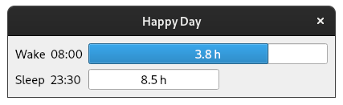

# Happy Day

Don't lose track of the time. Also, 24 hours is actually quite a lot of hours!

* Phases and times can be configured in code
* Show progress bar of passed time for each phase
* Progress bar size is linked to duration of the phase
* Show label of remaining time
